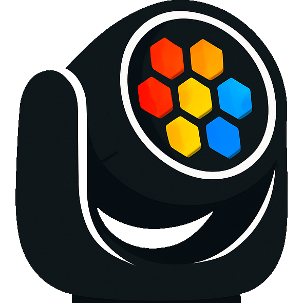

<h1 align="center">
  
  <br/>
  LucaLights
</h1>

<h3 align="center">Bring some color to your ITGMania sessions!</h3>

---

## 🎯 What is this project?

**LucaLights** aims to simplify and reduce the cost of lighting setups in **ITGMania**.

**How?** By using [**WLED**](https://kno.wled.ge/) and the **DDP protocol**, you can use almost any LED bulb or strip you already own. Expanding your setup is as easy as purchasing one of the many supported WLED-compatible controllers—no fancy DMX equipment required!

LucaLights will let you map **any lighting event** sent out by ITGMania like Cabinet Lights or Pad Inputs to any light that is on the network.

You can create and customise the effects that will be sent out.

## 🌈 What your setup could look like (Maybe with a better color scheme)
https://github.com/user-attachments/assets/07af3149-8fe5-49e5-be16-c91e460b07d0

Example with a map in autoplay (Pad not shown as autoplay does not generate Player input events)

https://github.com/user-attachments/assets/871173e1-03d2-40d8-a855-149df1d1059f


---

## ⚙️ Basic Setup Guide

### ⚠️ Important – ITGMania Configuration Required!

Before LucaLights can work with ITGMania, you’ll need to modify the `Preferences.ini` file.

#### Windows

You can find it here:

```
%appdata%\ITGmania\Save\Preferences.ini
```

Make sure these two lines are configured as follows:

```ini
SextetStreamOutputFilename=\\.\pipe\StepMania-Lights-SextetStream
LightsDriver=SextetStreamToFile
```

#### Linux

You can find it here:

```
~/.itgmania/Save/Preferences.ini
```

Make sure these two lines are configured as follows:

```ini
SextetStreamOutputFilename=Save/StepMania-Lights-SextetStream.out
LightsDriver=SextetStreamToFile
```

> **Note:** On Linux, ITGMania uses a virtual filesystem (RageFileManager) that only allows writing to specific mounted directories. The `Save/` path is one of the writable mount points, which maps to `~/.itgmania/Save/` on disk. **Absolute paths (e.g., `/tmp/...`) or paths under `Data/` will not work** because they are either outside the virtual filesystem or mounted as read-only.

LucaLights will automatically create a FIFO (named pipe) at the configured path. The "Pipe Name" field in LucaLights defaults to `~/.itgmania/Save/StepMania-Lights-SextetStream.out` on Linux — make sure it matches the path ITGMania is configured to write to.

### ⚠️ Important – Read this very carefully

Keep in mind that LucaLights must be open **BEFORE** you open ITGMania.

- **Windows:** ITGMania checks for the named pipe created by LucaLights only once at startup.
- **Linux:** LucaLights creates a FIFO at the configured path. ITGMania’s `open()` call will block until a reader (LucaLights) is present, so starting LucaLights first ensures a smooth connection.

I have made a modified version of ITGMania that does let you open and close LucaLights at will, but i haven’t created a pull request for it yet.

---

### 🖥️ Basic Setup Demo

You just need the **IP address** of your WLED device — LucaLights will handle the rest.

[https://github.com/user-attachments/assets/bb3a2267-fd53-443d-bfa0-c9bf74e6e06f](https://github.com/user-attachments/assets/bb3a2267-fd53-443d-bfa0-c9bf74e6e06f)

A few notes:

* The **UDP port** must be set to **21234**.
* In WLED’s sync settings, ensure these values are configured correctly.
* Some settings (like DMX universe/start address) may interfere with DDP. If your lights stop responding, try resetting those.

Example configuration:


---

## 🧩 Supported Platforms

LucaLights *can* run on **Windows**, **Linux**, and **macOS**, and it works on all of them.

However, Windows is currently the primary supported platform until a proper cross-platform build system is implemented.

---

## 🔄 Updating

LucaLights includes **automatic update detection**.
In a future release, an option will be added to **ignore or skip updates**.

---

Let me know if you want to add sections for:

* 🔌 Hardware recommendations
* 🛠️ Build instructions
* 🐛 Troubleshooting
* 📄 License / badges / contributing

Happy to help further!
